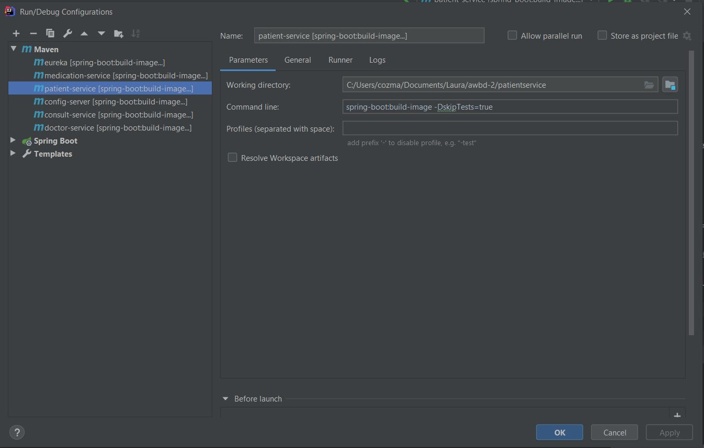
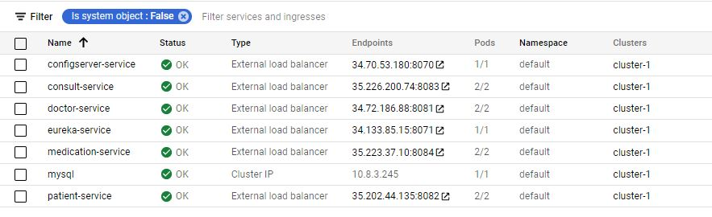
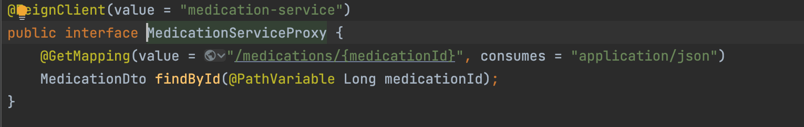
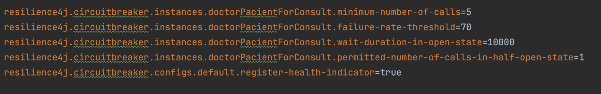
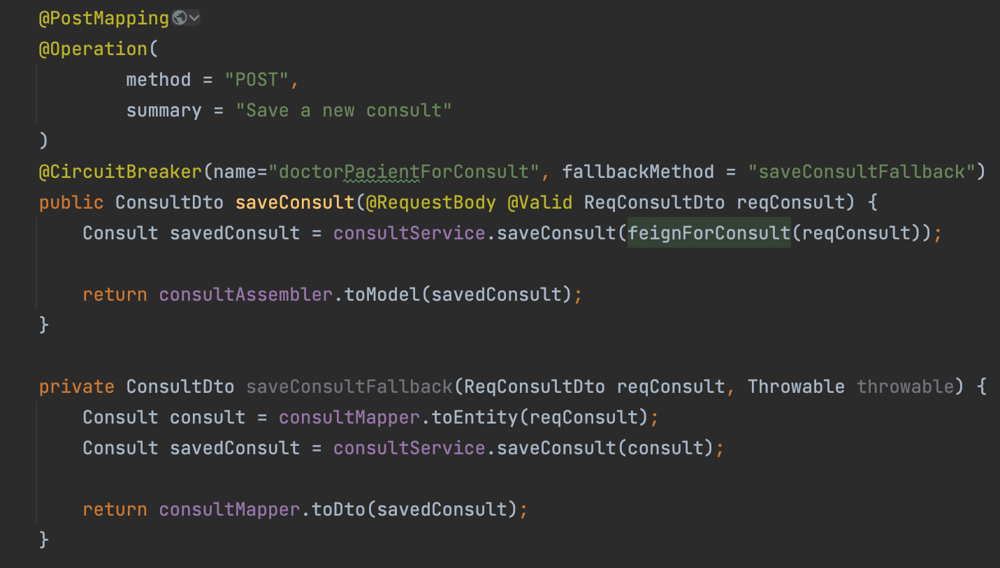

# About

Spring Boot project that shows how microservices interact with each other.

# Prerequisites

* Java 11
* Maven 3.8.4

# Technologies

* Spring Boot
* Maven
* Eureka Service
* Spring Cloud Config Server
    * Config server URI -> https://github.com/andreim9816/config-files.git
* Feign Rest Client
* Resilience4j
* MySQL Database
* Mapstruct
* Lombok
* HATEOAS
* Swagger UI
    * DoctorService -> http://localhost:8081/swagger-ui/index.html
    * PatientService -> http://localhost:8082/swagger-ui/index.html
    * ConsultService -> http://localhost:8083/swagger-ui/index.html#/
    * MedicationService -> http://localhost:8084/swagger-ui/index.html#/

# Build

```
mvn clean install -DskipTests
```

# Entities

* Doctor
* Patient
* Consult
* Medication

# Profiles

All microservices should run with the `dev` profile

# Running

For running the project, first start the `config-server` and `eureka` microservices. Then, you can run the "backend logic" microservices like `patient-service`, `doctor-service` etc in any order you want.

# Kubernetes

In order to deploy the microservices to Kubernetes, you should follow the next steps:

1. Make sure that `spring.config.import` is commented on each `application.properties` from `awbd-2`. The lines should already be commented on if you are on the `kubernetes` branch

2. Comment the `eureka.client.service-url.defaultZone` and `eureka.instance.prefer-ip-address` for each microservice in the `config-files` repository. Also, comment all the lines from the `eurekaserver.properties`. This should also be available on the `kubernetes` branch.

3. Create new Configurations to create Docker images for `configserver`, `eureka` and all the microservices (`doctor`, `patient` etc.) using the following template:



4. Run the configuration, then push the images to the central repository using `docker push <image_name>`

5. Create a cluster on Kubernetes and then connect to it 

6. Using the Google Cloud CLI apply all the images and the configmaps defined under the yaml files in `awbd-2/kubernetes`:
```$shell
kubectl apply configmaps.yml
kubectl apply config_server.yml
kubectl apply doctor.yml
...
```

7. If you need to delete a deployment or/and a service:
```$shell
kubectl delete deployment doctor-deployment
kubectl delete service doctor-service
```

Now, all the microservices are deployed to Kubernetes, using a MySql database:



### Util links: 

1. We have encountered the following problem: https://github.com/spring-cloud/spring-cloud-netflix/issues/2541
2. How to deploy a mysql database: https://phoenixnap.com/kb/kubernetes-mysql and https://justgiveacar.medium.com/spring-boot-micro-services-deployement-on-kubernetes-76c1d298c1f.


## Zipkin Distributed Tracing Server

We used a [Zipkin Docker image](https://hub.docker.com/r/openzipkin/zipkin/) that we ran locally using the next command:

```$shell
docker run -d -p 9411:9411 openzipkin/zipkin
```

By configuring each microservice with Zipkin, we can see the metrics at `http://localhost:9411/zipkin/`.

## Feign Client
We used Feign Client to connect the Consult microservice with the other microservices: Pacient, Doctor and Medication. For each of these three microservices we have created an interface (ex.: MedicationServiceProxy) with one findById method. We use them when we want to create a new consult and we need a pacient, a doctor and a list of medications.



## Resilience4j
We used Circuit Breaker for saveConsult and updateConsult methods, which depend on the other microservices. We have set a minimum number of calls to 5 and a failure rate threshold of 70.



We have also created a fallback method for both save and update methods.

